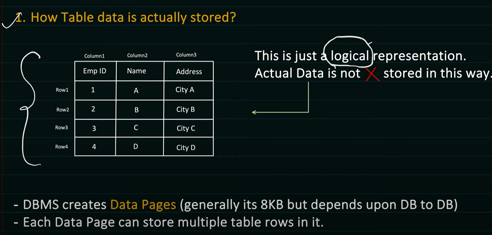
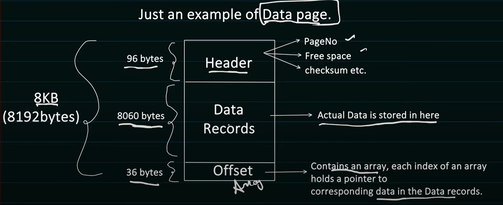
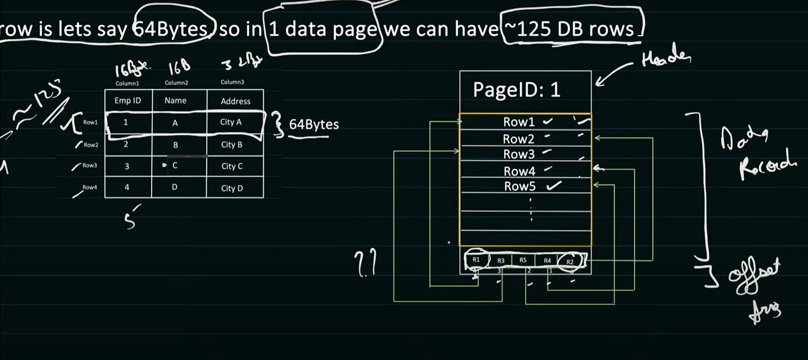
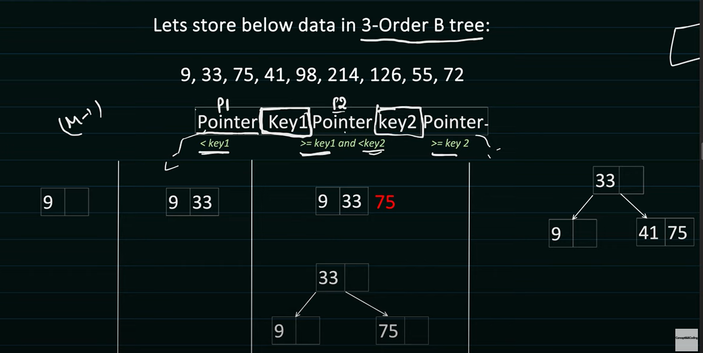

# DB Indexing

- `DBMS creates and manage these data pages`.
- As for storing `1 table data, it can create many data pages`.
- These data pages ultimately gets stored in the Data Block[managed by Storage system] in physical memory like disk.

## What is Data block?

- Data Block is the `minimum amount of data which can be read/write by an I/O operation`.
- It is `managed by underlying storage system like disk`.
- Data Block `size can range from 4kb to 32kb (common size is 8KB)`.
- So based on the data block size, it `can hold 1 or many Data page`.
- DBMS `maintains the mapping of DataPage and Data Block`.

            Data Page1 -> Data Block 1
            Data Page2 -> Data Block 1
            Data Page3 -> Data Block 2
            Data Page4 -> Data Block 2

- `DBMS controls Data pages(like what Row goes in which page or sequence of pages etc.) but has no control on Data Blocks (data blocks can be scattered over the disk)`

---

## Indexing

- It is used to `increased the performance of the database query`. So that data can be fetched faster.
- Without indexing, DBMS has to iterate each and every table row to find the requested data.
  i.e O(N), if there are millions of rows, query can take some time to fetch the data.

            Without indexing => O(N)
            With Indexing    => O(log N)

### Which Data Structure provides better time complexity then O(N) ?

- balanced `B+ Tree, it provides O(log N)` time complexity for insertion, searching & deletion.

### Balanced Tree

- It maintains sorted data.
- All leaf are at the same level
- `M order B tree means, each node can have at most M children's.`
- `And M-1 Keys per node`.

### DBMS uses B+ Tree to manage itsData Pages and Rows within the pages.

- `Root node or Intermediary node hold the Value which is used for faster searching the data`.
- Possible that value might have deleted from DB, but its can be used for sorting the tree.
- `Leaf node actually holds the indexed column value.`

## Types of Indexing

- `Clustered` Indexing

  - `Order of rows inside the data page matches with the order of index using the DATA PAGE Offset`.
  - There can be `only1 clustered index present / table because ordering of pages can be done based on one index only`.
  - If manually you have `not specified any Clustered index`, then DBMS looks `for PRIMARY KEY which is UNIQUE and NOT NULL` and use it as a Clustered key.
  - If in table there is `no PRIMARY KEY available`, then `internally it creates a hidden Column which is used as Clustered index`. (This columns just increase sequentially,
    so gurantted unique and not null)

- `Non-Clustered` Indexing
  - does not alter the physical order of the rows in the table
  - Takes up additional disk space because of the separate index structure
  - `CREATE NONCLUSTERED INDEX idx_email ON Users(email);`
  - When to Use Non-Clustered Index:
    - `Frequently Queried Columns` eg filtering
    - `Non-Primary Key Columns`
    - Composite Indexes

| **Aspect**                        | **Clustered Index**                                                        | **Non-Clustered Index**                                                |
| --------------------------------- | -------------------------------------------------------------------------- | ---------------------------------------------------------------------- |
| **Definition**                    | Determines the physical order of data in the table.                        | Does not affect the physical order of data, just points to data rows.  |
| **Data Storage**                  | Data is stored in the same structure as the index.                         | Data and index are stored separately.                                  |
| **Number per Table**              | Only one per table, because data can only be sorted one way.               | Multiple indexes can be created on a table.                            |
| **Primary Use**                   | Efficient for range queries and searching by primary key.                  | Efficient for specific column searches (e.g., filtering).              |
| **Example**                       | Primary Key by default is a clustered index.                               | Non-primary key columns or frequently queried columns.                 |
| **Performance for Range Queries** | Very efficient, as data is physically ordered.                             | Less efficient, requires additional lookups.                           |
| **Performance for Point Queries** | Efficient, but not as fast as non-clustered for individual column lookups. | Efficient for specific column lookups, but not for range queries.      |
| **Index Structure**               | B-tree or variations (can be implemented as clustered)                     | B-tree, Hash index, etc.                                               |
| **Updates Impact**                | Insertions or deletions may require reordering of data rows.               | Insertions or deletions update the index but do not affect data order. |
| **Space Usage**                   | Requires no extra space beyond the data itself.                            | Requires additional storage for the index structure.                   |

---

## Partitioning VS Sharding

| **Aspect**                 | **Partitioning**                                                                                   | **Sharding**                                                                                      |
| -------------------------- | -------------------------------------------------------------------------------------------------- | ------------------------------------------------------------------------------------------------- |
| **Definition**             | Dividing a large table into smaller, more manageable pieces (partitions) within the same database. | Dividing data across multiple databases or servers (shards).                                      |
| **Scope**                  | Happens within a single database.                                                                  | Happens across multiple databases or servers.                                                     |
| **Data Distribution**      | Data is logically split, but resides within one database.                                          | Data is physically distributed across multiple databases or servers.                              |
| **Goal**                   | Improve performance and manage large datasets within one database.                                 | Distribute data across multiple systems for better scalability and fault tolerance.               |
| **Application Complexity** | Transparent to the application (database manages it).                                              | The application may need to know which shard holds the data (depending on the sharding strategy). |
| **Performance**            | Improves performance for specific queries, especially those on large tables.                       | Improves performance and scalability by distributing the load.                                    |
| **Scalability**            | Limited to vertical scaling (scaling up the single database).                                      | Supports horizontal scaling (adding more machines/servers).                                       |
| **Failure Management**     | Failure of a partition does not affect other partitions, but still within a single database.       | Failure of a shard affects only the data in that shard, but can impact application availability.  |
| **Data Integrity**         | Easier to maintain consistency (within a single database).                                         | More complex consistency management (due to distributed nature).                                  |

### Which One to Choose?

- **Use Partitioning**:

  - When you have a `large table, but want to keep the data within a single database`.
  - When you want to improve query performance (especially for large datasets) without the complexity of managing multiple databases.
  - When your data `growth is not expected to exceed the capacity` of a single database or server.

- **Use Sharding**:
  - When you `need to scale horizontally, distributing` data across multiple databases or servers to handle a large volume of data.
  - When you need to `support distributed data processing and fault tolerance`.
  - When your `data is too large for a single machine or database` to handle efficiently, and you expect it to grow rapidly.
