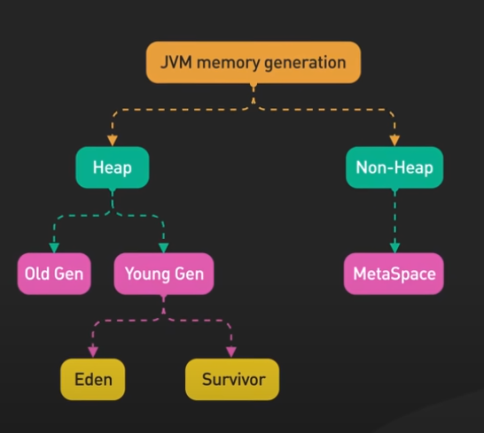

GC - mark, sweep, compact
System.gc();
Runtime.getRuntime().gc();

## GC

    - young
    	-eden  new oj created here
    	- survivor1 = when object are moved to here when minor gc  run when eden is full
    	- survivor2
    - old
    	- when max no survivor is done then moved here
    	- when old is full then major GC runs

    why multiple survivor = to avoid compacting step which is costly

- single thread
- concurrent - runs concurrently with ur program
- parallel -

finalize() is called when object is GC
it is called once per object, so initialized again in finalize next time before GC finalize() will not be called

- deprecated

## Memory

    - Stack
    	- smaller compared to heap memory
    	- store primitive data type
    	- scoped references
    	- store temp var
    	- thread store
    	- when its full stack overflow error
    - heap
    	- string pool
    	- object
    	- when heap is full out of memory error
