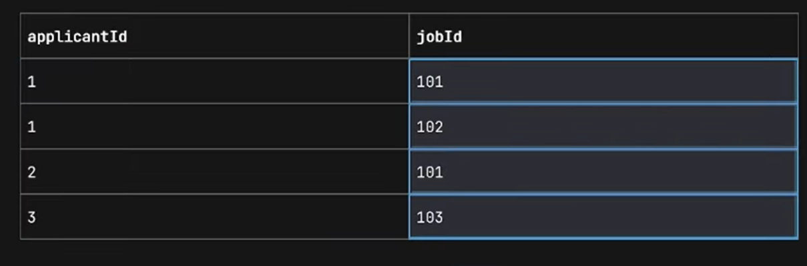

# JPA

https://www.youtube.com/watch?v=HWliKlc-HiI&list=PL-bgVzzRdaPhNeXyQBtp8hMlUc14J2kRK&index=30


## ENTITY Lifecycle


## @GeneratedValue

- has strategy type
  - GenerationType
    - `AUTO` : persistence provider should pick an appropriate strategy for the particular database
    - `TABLE`
    - `SEQUENCE`
    - `IDENTITY`

## JPA REPOSITORY


## @Query

```java
    public interface ApplicantJpaRepository extends JpaRepository<Applicant, Long> {
    List<Applicant> findByStatusOrderByNameAsc(String status);

        @Query("SELECT a FROM Applicant a WHERE a.name LIKE %:name%")
        List<Applicant> findApplicantsByPartialName(@Param("name") String name);

    }

```

---

## Spring Data JPA Relation

- @oneToOne
- @OneToMany
- @ManyToOne
- @ManyToMany

### 1. @OneToOne

```java
    @Entity
    public class Resume {
        @Id
        @GeneratedValue(strategy = GenerationType.AUTO)
        private Long id;

        private String content;


        @OneToOne
        @JsonIgnore
        @JoinColumn(name = "applicantId", nullable = false)  // only applicantId will be stored and works as FK, but while fetching it will get full applicant object
        private Applicant applicant;
    }

```

### cascade type

- nested storing of object will store the object property and then the main entity
- while deleting also first property entity will be deleted then the main entity

```java
@OneToOne(mappedBy = "applicant", cascade = CascadeType.ALL)
private Resume resume;
```

### 2. @OneToMany & @ManyToOne


### 3. @ManyToMany

- best to have one separate table having ids with mapping stored in that
  

```java
@ManyToMany
@JoinTable(
    name = "applicants_jobs",
    joinColumns = @JoinColumn(name = "applicantId"),
    inverseJoinColumns = @JoinColumn(name = "jobId")
)
private List<Job> jobs = new ArrayList<>();

```

```java
@ManyToMany (mappedBy = "jobs")
@JsonIgnore
private List<Applicant> applicants = new ArrayList<>();
```
