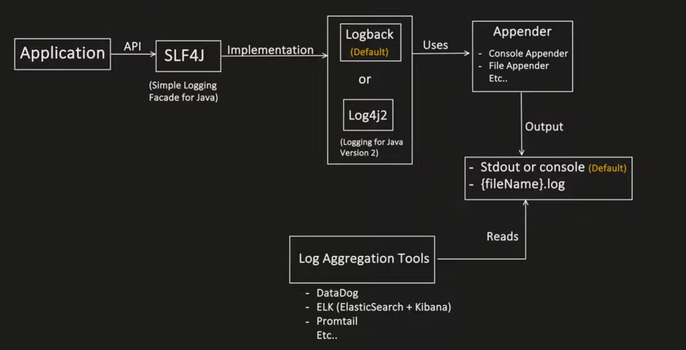
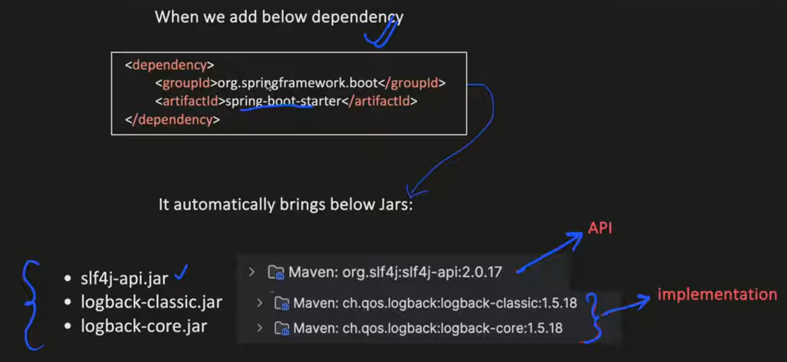
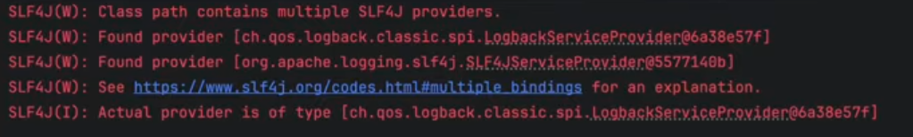
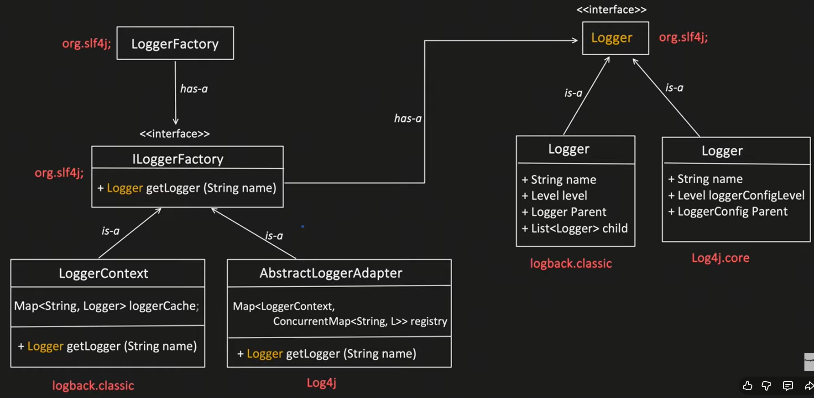

# Logging

- `recording important application events(request,error,warning) so that developers can monitor and debug` what the application is doing at runtime.

## How logging works for singleton app



- Spring boot has **SL4J** interface
  - its default implementation is **Logback**
    - default appender is **CONSOLE**

```java
@RestController
public class PaymentController {
    Logger log = LoggerFactory.getLogger(PaymentController.class);

    @GetMapping("/payments")
    public String getPayments() {
        log.info("fetch the payments successfully");
        return "successfully fetched all payments";
    }
}
```

---

## When Spring Dependency is added what happens



## IMPORTANT QUESTION

- By `default Springboot brings the "Logback" library`.
- But what if I want to use "Log4j2". Then `I have to add the dependency of "Log4j2", like below`:

```xml
<dependency>
    <groupld>org.springframework.boot</groupld>
    <artifactld>spring-boot-starter-log4j2</artifactld>
</dependency>
```

- Now, in c`lass path we have 2 implementation library of SLf4J`:
  - **Logback (default) one**
  - **Log4j2, which we have manually added**.
- Which implementation library will be used now?

- `LoggerFactory (Framework code)`

```java
private final static void bind() {
    try {
        List<SLF4JServiceProvider> providersList = findServiceProviders();
        reportMultipleBindingAmbiguity(providersList);
        if (providersList != null && !providersList.isEmpty()) {
            PROVIDER = providersList.get(0);     // from the list we will get the 1st one, but which one Logback or Log4J2
        }
    }
}
```

- We will `not get any error if both are present but we will get the warning`
  

- In prod we `should exclude the exclude the default LOGBACK and inorder to include the LOG4J2`

```xml
<dependency>
    <groupld>org.springframework.boot</groupld>
    <artifactld>spring-boot-starter</artifactld>
    <exclusions>
        <exclusion>
            <groupld>org.springframework.boot</groupld>
            <artifactld>spring-boot-starter-logging</artifactld>
        </exclusion>
    </exclusions>
</dependency>

<dependency>
    <groupld>org.springframework.boot</groupld>
    <artifactld>spring-boot-starter-log4j2</artifactld>
</dependency>
```

---

## Low Level Design for Logger



---

## Logger Object

### 1. Name [String name]

- name of the logger, name can be
  - **package name**
  - **class name**
  - **or any string**
- for any logger name only `1 logger object is create and reused, recommendation is to use className for logger`

```java
    Logger logger = LoggerFactory.getLogger(PaymentService.class)   // com.abc.PaymentService
```

### 2. level [Level level]

- for each logger we configure a log level
- various levels
  - Error [Highest priority]
  - Warn
  - Info [Default]
  - Debug
  - Trace [Lowest priority]
- And each Log statement implicitly has its own level based on the method used.

```text
log.debug(" ... ");
log.info(" ... ");
log.error(" ... ");
```

- Logger `prints a logs statement only if log statement level is same or higher than the Logger configured level`.
- `Logging level in spring boot can be changed using application.properties or application.yaml`

```property
1️⃣ Global Logging Level
logging.level.root=INFO

2️⃣ Package-Specific Logging
logging.level.com.myapp=DEBUG
logging.level.org.springframework=INFO
logging.level.org.hibernate.SQL=DEBUG

3️⃣ Class-Specific Logging
logging.level.com.myapp.service.UserService=TRACE


🔍 Show SQL Queries (Hibernate)
logging.level.org.hibernate.SQL=DEBUG
logging.level.org.hibernate.type.descriptor.sql=TRACE

🌐 REST Request/Response Logs
logging.level.org.springframework.web=DEBUG

🚀 Startup Logs
logging.level.org.springframework.boot=INFO
```

### 3. Logger parent

-

### 4. List<Logger> child

-
