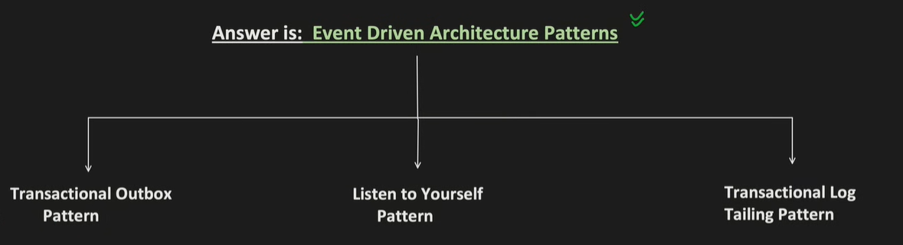
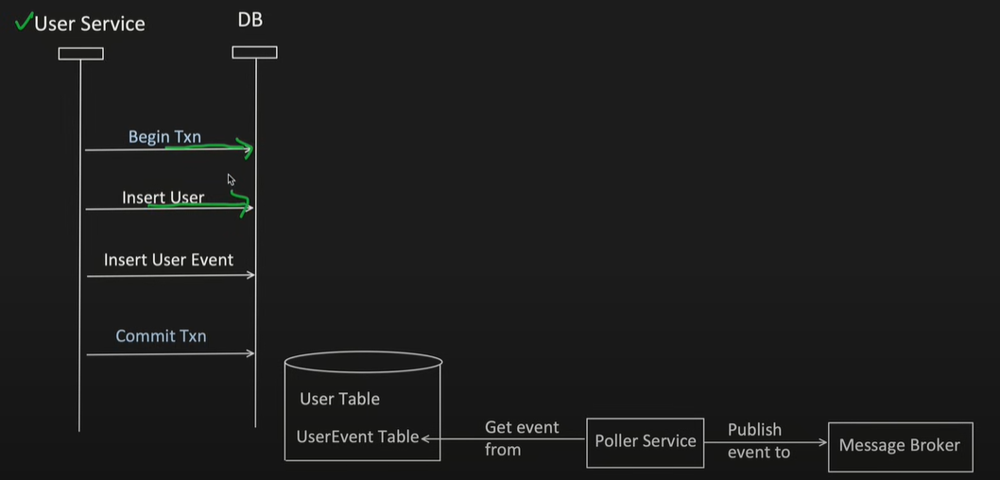
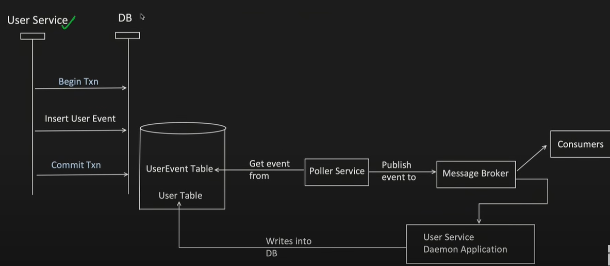
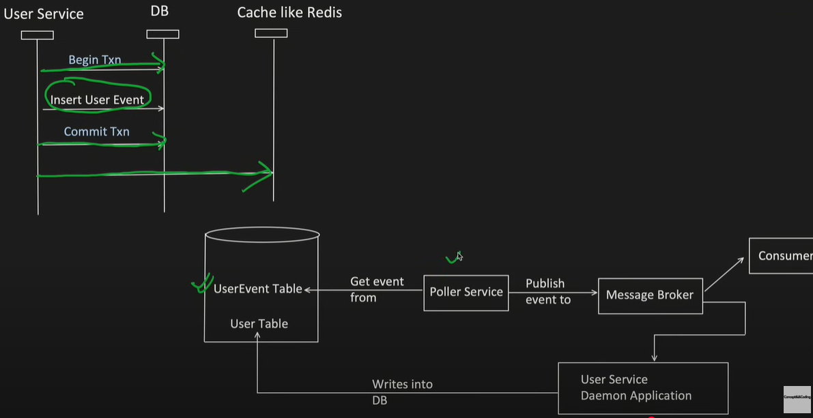
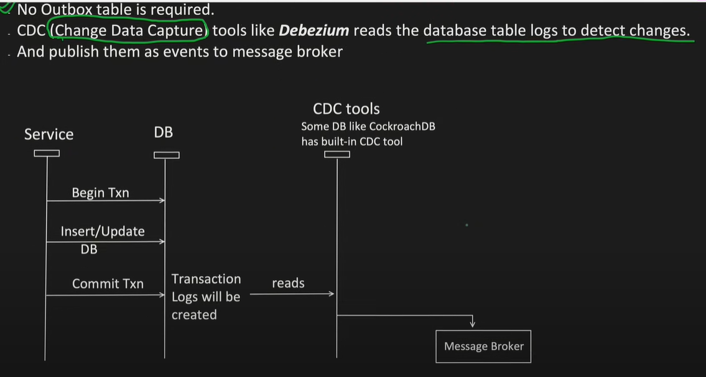

# The Dual Write Problem

https://www.youtube.com/watch?v=QaH7r4V4RmE&t=512s

- The Dual Write Problem occurs when a component needs to persist a change in two different systems
  say DB and Message broker like Kafka.

- We need to make sure that both are in consistent state. There should not be any case when DB is
  success but event publishing got failed or vice-versa

## 1.How to resolve this?

### 2PC (Two - Phase Commit)

The first thing comes to mind is : 2PC (Two - Phase Commit)

- In this 2PC, there is a coordinator.
- Which sends Prepare message to all the participant services. And wait for Ack.
- Once Ack received then it will send Commit message and again waits for the Ack message.

This makes sure that, all the participant services has properly committed the txn.

`2PC is not a viable solution for Dual Write Problem, Why so?`

- Dual Write scenarios may involves heterogenous system like (DB + Message Queue). And
  some Message Queue or Broker do not support 2PC.

- In Distributed system, 2PC is slow (gives high latency), as it provides Strong Consistency by
  waiting for all the participants to Commit.

- If 2PC coordinator crashes, participants may stuck in an uncertain state. Till its recovered.

# Solution

## 1. Transactional Outbox Pattern

- In this pattern, instead of writing in both DB and publishing an event, it `first writes the event into a separate table called OUTBOX table`.

- Later, a `separate process (poller) reads the Outbox table, and publish the event to a message` broker in async manner.

### Challenges:

1. Extra effort to write this Poller service.

2. Delay between writing an event and publishing it.

3. A Poller may publish the event multiple times to Broker. So Idempotency should be handled.

   - Producer need to set "enable.idempotency=true"
   - Then Kafka, assigns a producer id to each producer when they starts.
   - Also every message sent from that producer now has a monotonically increasing sequencing number.
   - if kaka sees duplicate (producer id + sequence no) it discard the event automatically.

4. Or Multiple Poller can pick same events and cause duplication of events published.

   - Now this will not help "enable.idempotency=true" . Because different producer will get different PID.
   - So, at Consumer side Idempotency should be handled too, in cache they can store the unique ids of events which they have processed.

5. Events might be published Out of Order if different pollers picking events parallel.

   - Kafka only guarantees order if there is only 1 producer and 1 partition.
   - If there are multiple producers and multiple partitions, then ordering is not guaranteed.
   - In ordering is must, and we have scenarios where multiple producers and partitions are there, then `Kafka Streams` can be used.

6. What if Poller not able to publish the event to message broker. So event should not be lost.

   - Exponential Backoff and jitter - `Retry mechanism`
   - After retries, move to Failed event table or depend upon how outbox table is used (if status column is maintained, then it can be in that table itself)

7. Outbox table can grow, should be cleaned up regularly.
   - After every message or event published successfully.
   - Or batch job

## 2. Listen to Yourself Pattern

- Just a variation of Transactional Outbox Pattern.
- Application writes only event in the Outbox table.
- Then Poller fetch the event from the Outbox table and publish an event.
- Application also listen to the same event and now update its DB.

### Challenges in Listen to Yourself

- Since main operation entry, is written in async manner, if GET calls comes before event is
  published and consumed.
- Then GET call will not find any data in the DB

  - To resolve this, `"Write through Cache`" technique is used.
  - When Get call comes, it first try to look into cache, if not found then only look for DB. So
  - even though event is not processed, GET request get fulfilled via Cache.

  

## 3. Transactional Log Trailing Pattern

- No Outbox table is required.
- `CDC(Change Data Capture) tools like Debezium reads the database table logs to detect changes`.
- And publish them as events to message broker

