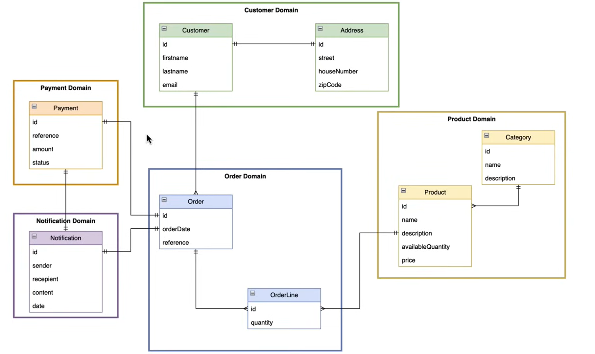
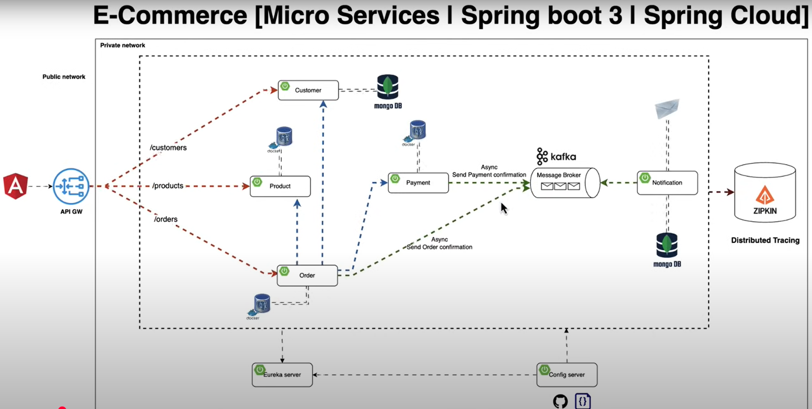

# ECOM - Microservice

## CLASS DIAGRAM



## ARCHITECTURE



## CONFIG SERVER

- to store all configurations of all services in one central place
- `provides centralized external configuration management for applications` in a microservices architecture
- `@EnableConfigServer`
- dependency `spring-cloud-config-server`

        <dependency>
            <groupId>org.springframework.cloud</groupId>
            <artifactId>spring-cloud-config-server</artifactId>
        </dependency>

- set path from where to find configurations

        spring:
            cloud:
                config:
                    server:
                        native:
                            search-locations: classpath:/configurations

- Inside configurations folder, the name of the config file should be `{springApplicationNameMentionedInRespectiveApplicationFile}.yml`

- `Common properties for all configs` can be put inside `application.properties/yml` Inside configurations folder
- common properties like

  - eureka server hostname
  - defaultzone
  - override-system-properties

  ```java
      eureka:
        instance:
          hostname: localhost
        client:
          service-url:
            defaultZone: http://localhost:8761/eureka
      name:
        value: alibou
      spring:
        cloud:
          config:
            override-system-properties: false    // so that whatever properties mentioned in specific service properties file are not override

      management:
        tracing:
          sampling:
            probability: 1.0

  ```

### How other service will import config from config server

- `spring.config.import= optional:configserver:http://localhost:port`

### How do you refresh the configuration in a Spring Cloud Config Client application?

- Add the `spring-boot-starter-actuator dependency` in the client's pom.xml.
- Enable the `@RefreshScope annotation on beans whose properties you want to be reloaded at runtime.`
- This can be done by calling the `/actuator/refresh endpoint`

## SERVER DISCOVERY

- service discovery tool built on top of Netflix Eureka
- It helps in `registering microservices and enables` client-side load balancing.
- Eureka Server `acts as a registry where microservices can register themselves`, and the client applications can discover these services `without needing to know their IP addresses or hostnames`
- dependency `config client` & `eureka server`

            ```java
            <dependency>
                <groupId>org.springframework.cloud</groupId>
                <artifactId>spring-cloud-starter-config</artifactId>
            </dependency>
            <dependency>
                <groupId>org.springframework.cloud</groupId>
                <artifactId>spring-cloud-starter-netflix-eureka-server</artifactId>
            </dependency>
            ```

### configure Eureka Server in a Spring Boot

- Annotate the main application class with `@EnableEurekaServer`
-

### fetch-registry:

- If set to `false`, the Eureka Client `will not fetch the registry information from the Eureka Server`. This can be useful when you don't need to query for other services and only want to register.

### register-with-eureka:

- If set to `false`, the Eureka Client `will not register itself with the Eureka Server`. This is useful in scenarios where you want the client to only discover services, but not register itself.

            ```java
            eureka:
                client:
                    fetch-registry: false
                    register-with-eureka: false
            ```

### defaultZone

- defines the` URL of the Eureka Server`.
- It is `used by the client to know where to register itself and where to query for service instances`.

            eureka:
                client:
                    service-url:
                        defaultZone: http://localhost:8761/eureka/

### What is eureka.instance.hostname property used for?

- `define the hostname of the instance that is being registered with Eureka Server`
- If not set, Eureka will try to determine the hostname automatically
- `useful` when running applications behind a load balancer or in cloud environments `where automatic IP resolution may not be reliable`

## Customer - Microservice

- dependency `config client` & `eureka Discovery client`

## KAFKA

### Kafka Topic Bean

```java
@Configuration
public class KafkaOrderTopicConfig {

    @Bean
    public NewTopic orderTopic() {
        return TopicBuilder
                .name("order-topic")
                .build();
    }
}
```

### Kafka Producer

```java
@Service
@RequiredArgsConstructor
@Slf4j
public class OrderProducer {

    private final KafkaTemplate<String, OrderConfirmation> kafkaTemplate;

    public void sendOrderConfirmation(OrderConfirmation orderConfirmation) {
        log.info("Sending order confirmation");
        Message<OrderConfirmation> message = MessageBuilder
                .withPayload(orderConfirmation)
                .setHeader(TOPIC, "order-topic")
                .build();

        kafkaTemplate.send(message);
    }
}
```

### Kafka Serializer - producer

- `need to define the serializer and deserializer if producing & consuming custom objects other than String`
- for PRODUCER [in producer service properties]

```java
        spring:
          kafka:
            producer:
              bootstrap-servers: localhost:9092
              key-serializer: org.apache.kafka.common.serialization.StringSerializer
              value-serializer: org.springframework.kafka.support.serializer.JsonSerializer
              properties:
                spring.json.type.mapping: orderConfirmation:com.alibou.ecommerce.kafka.OrderConfirmation
```

### Kafka Consumer

- `@KafkaListener(topics = "order-topic")`

```java
   @KafkaListener(topics = "order-topic")
    public void consumeOrderConfirmationNotifications(OrderConfirmation orderConfirmation) throws MessagingException {
        log.info(format("Consuming the message from order-topic Topic:: %s", orderConfirmation));
        repository.save(
                Notification.builder()
                        .type(ORDER_CONFIRMATION)
                        .notificationDate(LocalDateTime.now())
                        .orderConfirmation(orderConfirmation)
                        .build()
        );
        var customerName = orderConfirmation.customer().firstname() + " " + orderConfirmation.customer().lastname();
        emailService.sendOrderConfirmationEmail(
                orderConfirmation.customer().email(),
                customerName,
                orderConfirmation.totalAmount(),
                orderConfirmation.orderReference(),
                orderConfirmation.products()
        );
    }
```

### Kafka De-Serializer - Consumer

```java
spring:
  kafka:
    consumer:
      bootstrap-servers: localhost:9092
      group-id: paymentGroup,orderGroup
      auto-offset-reset: earliest
      key-deserializer: org.apache.kafka.common.serialization.StringDeserializer
      value-deserializer: org.springframework.kafka.support.serializer.JsonDeserializer
      properties:
        spring.json.trusted.packages: 'com.alibou.ecommerce.kafka.*'
        spring.json.type.mapping: orderConfirmation:com.alibou.ecommerce.kafka.order.OrderConfirmation,paymentConfirmation:com.alibou.ecommerce.kafka.payment.PaymentConfirmation
```
