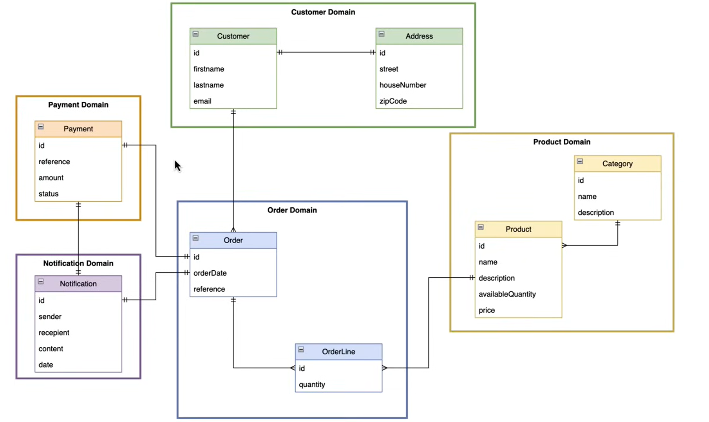
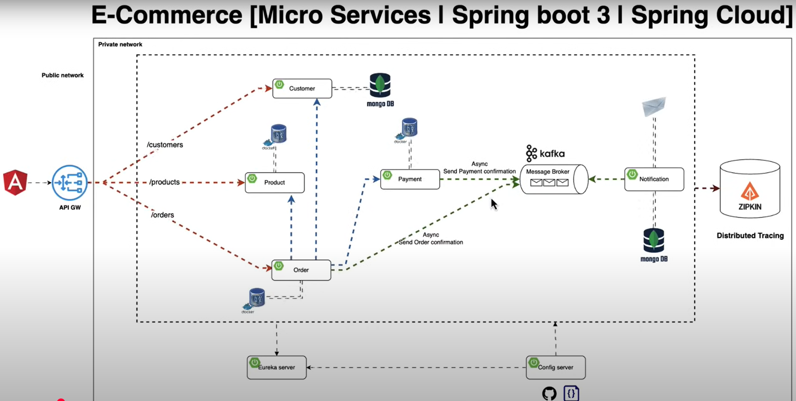

# ECOM - Microservice

## CLASS DIAGRAM



## ARCHITECTURE



## CONFIG SERVER

- to store all configurations of all services in one central place
- `provides centralized external configuration management for applications` in a microservices architecture
- `@EnableConfigServer`
- dependency `spring-cloud-config-server`

```xml
        <dependency>
            <groupId>org.springframework.cloud</groupId>
            <artifactId>spring-cloud-config-server</artifactId>
        </dependency>
```

- set path from where to find configurations

```yml
spring:
  cloud:
    config:
      server:
        native:
          search-locations: classpath:/configurations
```

- Inside configurations folder, the name of the config file should be `{springApplicationNameMentionedInRespectiveApplicationFile}.yml`

- `Common properties for all configs` can be put inside `application.properties/yml` Inside configurations folder
- common properties like

  - eureka server hostname
  - defaultzone
  - override-system-properties

  ```yml
  eureka:
    instance:
      hostname: localhost
    client:
      service-url:
        defaultZone: http://localhost:8761/eureka
  name:
    value: alibou
  spring:
    cloud:
      config:
        override-system-properties: false    // so that whatever properties mentioned in specific service properties file are not override

  management:
    tracing:
      sampling:
        probability: 1.0
  ```

### How other service will import config from config server

- `spring.config.import= optional:configserver:http://localhost:port`

### How do you refresh the configuration in a Spring Cloud Config Client application?

- Add the `spring-boot-starter-actuator dependency` in the client's pom.xml.
- Enable the `@RefreshScope annotation on beans whose properties you want to be reloaded at runtime.`
- This can be done by calling the `/actuator/refresh endpoint`

---

## SERVER DISCOVERY

- service discovery tool built on top of Netflix Eureka
- It helps in `registering microservices and enables` client-side load balancing.
- Eureka Server `acts as a registry where microservices can register themselves`, and the client applications can discover these services `without needing to know their IP addresses or hostnames`
- dependency `config client` & `eureka server`

```xml
            <dependency>
                <groupId>org.springframework.cloud</groupId>
                <artifactId>spring-cloud-starter-config</artifactId>
            </dependency>
            <dependency>
                <groupId>org.springframework.cloud</groupId>
                <artifactId>spring-cloud-starter-netflix-eureka-server</artifactId>
            </dependency>
```

### configure Eureka Server in a Spring Boot

- Annotate the main application class with `@EnableEurekaServer`
-

### fetch-registry:

- If set to `false`, the Eureka Client `will not fetch the registry information from the Eureka Server`. This can be useful when you don't need to query for other services and only want to register.

### register-with-eureka:

- If set to `false`, the Eureka Client `will not register itself with the Eureka Server`. This is useful in scenarios where you want the client to only discover services, but not register itself.

```yml
eureka:
  client:
    fetch-registry: false
    register-with-eureka: false
```

### defaultZone

- defines the` URL of the Eureka Server`.
- It is `used by the client to know where to register itself and where to query for service instances`.

```yml
eureka:
  client:
    service-url:
      defaultZone: http://localhost:8761/eureka/
```

### What is eureka.instance.hostname property used for?

- `define the hostname of the instance that is being registered with Eureka Server`
- If not set, Eureka will try to determine the hostname automatically
- `useful` when running applications behind a load balancer or in cloud environments `where automatic IP resolution may not be reliable`

## Customer - Microservice

- dependency `config client` & `eureka Discovery client`

---

## KAFKA

### Kafka Topic Bean

```java
@Configuration
public class KafkaOrderTopicConfig {

    @Bean
    public NewTopic orderTopic() {
        return TopicBuilder
                .name("order-topic")
                .build();
    }
}
```

### Kafka Producer

```java
@Service
@RequiredArgsConstructor
@Slf4j
public class OrderProducer {

    private final KafkaTemplate<String, OrderConfirmation> kafkaTemplate;

    public void sendOrderConfirmation(OrderConfirmation orderConfirmation) {
        log.info("Sending order confirmation");
        Message<OrderConfirmation> message = MessageBuilder
                .withPayload(orderConfirmation)
                .setHeader(TOPIC, "order-topic")
                .build();

        kafkaTemplate.send(message);
    }
}
```

### Kafka Serializer - producer

- `need to define the serializer and deserializer if producing & consuming custom objects other than String`
- for PRODUCER [in producer service properties]

```yml
spring:
  kafka:
    producer:
      bootstrap-servers: localhost:9092
      key-serializer: org.apache.kafka.common.serialization.StringSerializer
      value-serializer: org.springframework.kafka.support.serializer.JsonSerializer
      properties:
        spring.json.type.mapping: orderConfirmation:com.alibou.ecommerce.kafka.OrderConfirmation
```

### Kafka Consumer

- `@KafkaListener(topics = "order-topic")`

```java
   @KafkaListener(topics = "order-topic")
    public void consumeOrderConfirmationNotifications(OrderConfirmation orderConfirmation) throws MessagingException {
        log.info(format("Consuming the message from order-topic Topic:: %s", orderConfirmation));
        repository.save(
                Notification.builder()
                        .type(ORDER_CONFIRMATION)
                        .notificationDate(LocalDateTime.now())
                        .orderConfirmation(orderConfirmation)
                        .build()
        );
        var customerName = orderConfirmation.customer().firstname() + " " + orderConfirmation.customer().lastname();
        emailService.sendOrderConfirmationEmail(
                orderConfirmation.customer().email(),
                customerName,
                orderConfirmation.totalAmount(),
                orderConfirmation.orderReference(),
                orderConfirmation.products()
        );
    }
```

### Kafka De-Serializer - Consumer

```yml
spring:
  kafka:
    consumer:
      bootstrap-servers: localhost:9092
      group-id: paymentGroup,orderGroup
      auto-offset-reset: earliest
      key-deserializer: org.apache.kafka.common.serialization.StringDeserializer
      value-deserializer: org.springframework.kafka.support.serializer.JsonDeserializer
      properties:
        spring.json.trusted.packages: 'com.alibou.ecommerce.kafka.*'
        spring.json.type.mapping: orderConfirmation:com.alibou.ecommerce.kafka.order.OrderConfirmation,paymentConfirmation:com.alibou.ecommerce.kafka.payment.PaymentConfirmation
```

---

## API GATEWAY

- dependency

  - `client-config`
  - `eureka-client`
  - `gateway`

```xml
        <dependency>
            <groupId>org.springframework.cloud</groupId>
            <artifactId>spring-cloud-starter-config</artifactId>
        </dependency>
        <dependency>
            <groupId>org.springframework.cloud</groupId>
            <artifactId>spring-cloud-starter-gateway</artifactId>
        </dependency>
        <dependency>
            <groupId>org.springframework.cloud</groupId>
            <artifactId>spring-cloud-starter-netflix-eureka-client</artifactId>
        </dependency>
```

### properties

```yml
spring:
  cloud:
    gateway:
      discovery:      // to get all the available microservices from the eureka server
        locator:
          enabled: true
      routes:
        - id: customer-service
          uri: lb:http://CUSTOMER-SERVICE
          predicates:
            - Path=/api/v1/customers/**
        - id: order-service
          uri: lb:http://ORDER-SERVICE
          predicates:
            - Path=/api/v1/orders/**
        - id: order-lines-service
          uri: lb:http://ORDER-SERVICE
          predicates:
            - Path=/api/v1/order-lines/**
        - id: product-service
          uri: lb:http://PRODUCT-SERVICE
          predicates:
            - Path=/api/v1/products/**
        - id: payment-service
          uri: lb:http://PAYMENT-SERVICE
          predicates:
            - Path=/api/v1/payments/**
```

### # Types of Predicates in API Gateway

- Predicates in API Gateway are` used to route or filter incoming HTTP requests based on specific conditions`. Below are the common types of predicates used in API Gateway.

## 1. **Path-Based Predicate**

- **Definition**: A predicate based on the URL path of the incoming request.
- **Usage**: Routes requests to different backends or services depending on the resource path.
- **Example**:
  - `GET /api/v1/users` → Routes requests to the backend for user resources.
  - `POST /api/v1/orders` → Routes requests to the backend for order resources.

## 2. **Method-Based Predicate**

- **Definition**: A predicate based on the HTTP method (GET, POST, PUT, DELETE, etc.).
- **Usage**: Routes requests based on the HTTP method used.
- **Example**:
  - `GET /api/v1/users` → Fetch user data.
  - `POST /api/v1/users` → Create a new user.
  - `PUT /api/v1/users/{id}` → Update user info.
  - `DELETE /api/v1/users/{id}` → Delete a user.

## 3. **Query String Parameter Predicate**

- **Definition**: A predicate that evaluates query string parameters in the URL.
- **Usage**: Routes requests or customizes behavior based on query parameters.
- **Example**:
  - `GET /api/v1/products?category=electronics`
  - Routes requests based on the `category` query parameter.

## 4. **Header-Based Predicate**

- **Definition**: A predicate that evaluates HTTP headers in the request.
- **Usage**: Routes requests based on headers like `Authorization`, `Content-Type`, or custom headers.
- **Example**:
  - `GET /api/v1/products` with header `Accept: application/json`
  - `POST /api/v1/orders` with header `Authorization: Bearer <token>`

## 5. **Body Content Predicate (Request Body)**

- **Definition**: A predicate based on the content or structure of the request body.
- **Usage**: Routes requests or applies logic based on the body of the request.
- **Example**:
  - `POST /api/v1/users` with body `{ "role": "admin" }`
  - Routes or filters based on the role field in the body.

## 6. **Stage-Based Predicate**

- **Definition**: A predicate based on the stage of the API Gateway (e.g., `dev`, `prod`, `staging`).
- **Usage**: Routes or applies different configurations based on the API stage.
- **Example**:
  - `dev/api/v1/users`
  - `prod/api/v1/users`

## 7. **IP Address-Based Predicate**

- **Definition**: A predicate based on the source IP address of the request.
- **Usage**: Routes or applies logic based on the client's IP address.
- **Example**:
  - Allow requests only from IP `192.168.1.0/24`.

## 8. **Custom Authorization Predicate (JWT, OAuth, etc.)**

- **Definition**: A predicate based on the presence and validity of a custom authorization token, such as JWT or OAuth tokens.
- **Usage**: Validates that requests contain valid credentials or tokens before processing.
- **Example**:
  - `Authorization: Bearer <JWT>`
  - Validates that the request has a valid authorization token.

## 9. **Geolocation-Based Predicate**

- **Definition**: A predicate that uses the geolocation of the client to route traffic or apply logic.
- **Usage**: Routes requests to region-specific endpoints or customizes responses based on location.
- **Example**:
  - Requests from the US are routed to a US-based endpoint, and requests from Europe go to a European endpoint.

## 10. **Rate Limiting Predicate**

- **Definition**: A predicate that limits the rate of incoming requests to prevent abuse or overloading.
- **Usage**: Restricts the number of requests from a specific client within a given time frame.
- **Example**:
  - Allow a maximum of 100 requests per minute per user.

## Summary of Common Predicates in API Gateway:

- **Path-based predicates**: Route based on resource paths.
- **Method-based predicates**: Apply based on HTTP methods (GET, POST, etc.).
- **Query string parameters**: Use parameters like `?id=123`.
- **Headers**: Route or filter based on request headers.
- **Request body**: Apply logic based on the body content.
- **Stage**: Apply predicates based on deployment stages (dev, prod).
- **IP address**: Route based on client IP.
- **Authorization**: Validate tokens like JWT.
- **Geolocation**: Route based on geographical location.
- **Rate limiting**: Control the frequency of requests.

These predicates help manage traffic, enforce security, and define routing rules for your APIs, ensuring efficient and secure operation.

---

## Distributed Tracing [Zipkin / OpenTelemetry]

- technique used `to monitor and troubleshoot the performance of distributed systems`, typically in microservices architectures.
- It helps trace the `flow of requests as they travel through various services in a system`, allowing you to track their journey and understand how long each component takes to process requests.
- This provides visibility into the system's behavior, making it easier to identify bottlenecks, failures, and performance issues.
- **key concepts**

  - `Trace`:

    - A trace represents the entire journey of a request across different services in a distributed system. It consists of multiple spans that describe individual operations within the system.

  - `Span`:
    - A span is a single unit of work or operation. It represents a request or a task that is processed by a service (for example, a database query or HTTP request to another service). Each span has:
      - A start time and an end time.
      - An operation name (e.g., "GET /users").

- dependency

```xml
    <dependency>
			<groupId>org.springframework.boot</groupId>
			<artifactId>spring-boot-starter-actuator</artifactId>
		</dependency>

		<dependency>
			<groupId>io.micrometer</groupId>
			<artifactId>micrometer-tracing-bridge-brave</artifactId>
		</dependency>
		<dependency>
			<groupId>io.zipkin.reporter2</groupId>
			<artifactId>zipkin-reporter-brave</artifactId>
		</dependency>

```
```text
Trace ID: abc123
|
|-- Span ID: 1 (Start - API Gateway)
    |
    |-- Span ID: 2 (Auth Service)
    |
    |-- Span ID: 3 (Order Service)
        |
        |-- Span ID: 4 (Database Query)
```

| Term           | Description                        | Scope                | Used For                              |
| -------------- | ---------------------------------- | -------------------- | ------------------------------------- |
| `traceId`      | ID for the **entire trace**        | Across services      | Grouping all spans of a request       |
| `spanId`       | ID for a **single operation/span** | One service/function | Representing individual units of work |
| `parentSpanId` | Links a span to its parent         | Within trace         | Building hierarchical call trees      |

```json
{
  "traceId": "abc123",
  "spanId": "span789",
  "parentSpanId": "span456",
  "name": "GET /api/orders",
  "startTime": "...",
  "endTime": "...",
  "status": "OK"
}

```

---

## Circuit breaker

# ⚡ Spring Cloud Circuit Breaker vs Hystrix Circuit Breaker

| Feature / Aspect                 | **Hystrix**                          | **Spring Cloud Circuit Breaker**                  |
| -------------------------------- | ------------------------------------ | ------------------------------------------------- |
| **Maintained?**                  | ❌ No (Netflix discontinued support) | ✅ Yes (actively maintained by Spring team)       |
| **Part of Spring Cloud?**        | ✅ Yes (legacy support)              | ✅ Yes (recommended for modern Spring Boot apps)  |
| **Reactive Support?**            | 🚫 Limited                           | ✅ Native reactive support (`WebFlux`, etc.)      |
| **Pluggable Backends?**          | 🚫 No (Hystrix only)                 | ✅ Yes – Resilience4j, Sentinel, and even Hystrix |
| **Modern / Clean API?**          | 😕 Older and more complex            | ✅ Simple, clean, Boot-friendly abstraction       |
| **Annotation Support**           | `@HystrixCommand`                    | `@CircuitBreaker(name = "X")` via Resilience4j    |
| **Fallback Support**             | ✅ Yes                               | ✅ Yes                                            |
| **Integration with Spring Boot** | ✅ Works (but older style)           | ✅ Excellent (native to Spring Boot 2.x/3.x+)     |
| **Future-Proof?**                | ❌ No                                | ✅ Yes                                            |

### Hystrix:

```java
@HystrixCommand(fallbackMethod = "fallback")
public String getData() {
    // call external API
}
```

### Spring Cloud

```xml
<dependency>
    <groupId>org.springframework.cloud</groupId>
    <artifactId>spring-cloud-starter-circuitbreaker-resilience4j</artifactId>
</dependency>
```

```java
@CircuitBreaker(name = "myService", fallbackMethod = "fallback")
public String callRemoteService() {
    // call external API
}
```
