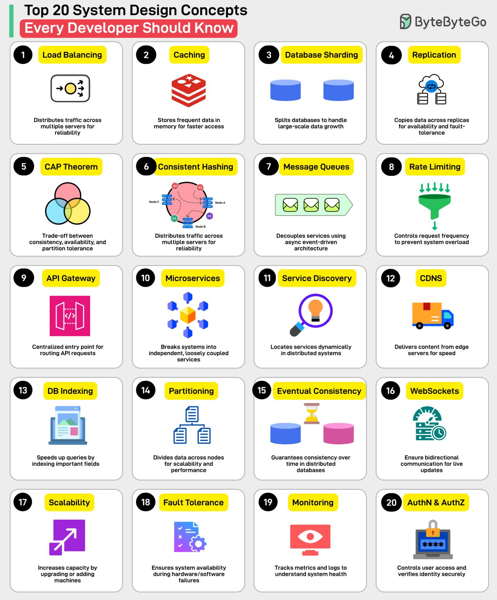

- **Load Balancing**: Distributes traffic across multiple servers for reliability and availability.
- **Caching**: Stores frequently accessed data in memory for faster access.
- **Database Sharding**: Splits databases to handle large-scale data growth.
- **Replication**: Copies data across replicas for availability and fault tolerance.
- **CAP Theorem**: Trade-off between consistency, availability, and partition tolerance.
- **Consistent Hashing**: Distributes load evenly in dynamic server environments.
- **Message Queues**: Decouples services using asynchronous event-driven architecture.
- **Rate Limiting**: Controls request frequency to prevent system overload.
- **API Gateway**: Centralized entry point for routing API requests.
- **Microservices**: Breaks systems into independent, loosely coupled services.
- **Service Discovery**: Locates services dynamically in distributed systems.
- **CDN**: Delivers content from edge servers for speed.
- **Database Indexing**: Speeds up queries by indexing important fields.
- **Data Partitioning**: Divides data across nodes for scalability and performance.
- **Eventual Consistency**: Guarantees consistency over time in distributed databases.
- **WebSockets**: Enables bi-directional communication for live updates.
- **Scalability**: Increases capacity by upgrading or adding machines.
- **Fault Tolerance**: Ensures system availability during hardware/software failures.
- **Monitoring**: Tracks metrics and logs to understand system health.
- **Authentication & Authorization**: Controls user access and verifies identity securely.

