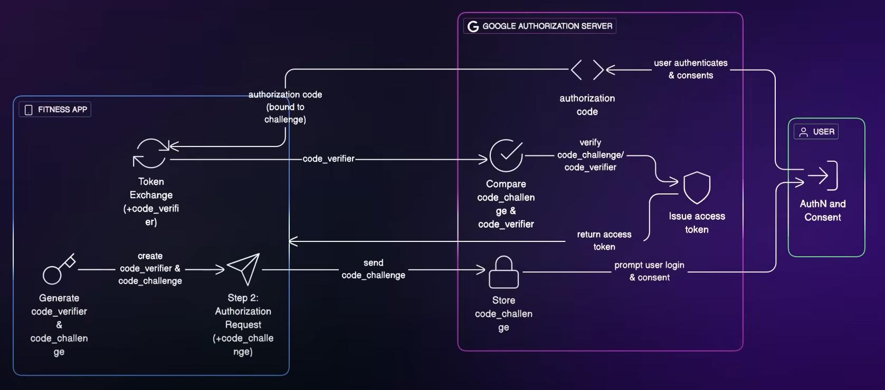

# PKCE [Proof Key for Code Exchange]

- enhancement to the Authorization Code Flow in OAuth 2.0, primarily `designed to make public clients (like mobile or single-page apps)` more secure when performing authorization.



## 🔐 Why PKCE is Needed

- to prevent this kind of `authorization code interception attack`.

## PKCE Authorization Flow Steps

1. `Client Generates a Code Verifier`

- A random string (43-128 characters), e.g.:

```text
code_verifier = "sdf3fslFslw4efslweFslF234DFsfsdflsdf"
```

2. `Client Derives a Code Challenge`

- Usually a base64url-encoded SHA256 hash of the verifier:
- PKCE supports two methods:
  - S256 (recommended)
  - plain (not secure, just the raw verifier)

```text
code_challenge = BASE64URL-ENCODE(SHA256(code_verifier))
```

3. `Authorization Request (with code_challenge)`

- Client redirects the user to the authorization server like:

```text
GET /authorize?
  response_type=code
  &client_id=your_client_id
  &redirect_uri=https://yourapp.com/callback
  &code_challenge=code_challenge
  &code_challenge_method=S256
  &state=random_state
```

4. `User Authenticates and Authorizes`

- User logs in and grants access.

5. `Authorization Server Sends Authorization Code`

- Redirects the browser back to your redirect URI with:

```text
https://yourapp.com/callback?code=auth_code&state=random_state
```

6. `Token Request (with code_verifier)`

- Client then sends:

```text
bash
Copy
Edit
POST /token
Content-Type: application/x-www-form-urlencoded

grant_type=authorization_code
&code=auth_code
&redirect_uri=https://yourapp.com/callback
&code_verifier=code_verifier
```

7. `Authorization Server Verifies`

- It compares the hash of the code_verifier to the originally sent code_challenge. If they match, it issues an access token.

### ✅ Benefits of PKCE

- Prevents authorization code interception
- Doesn’t require a client secret
- Ideal for mobile, desktop, and SPAs
- Now recommended for all clients — even confidential ones
