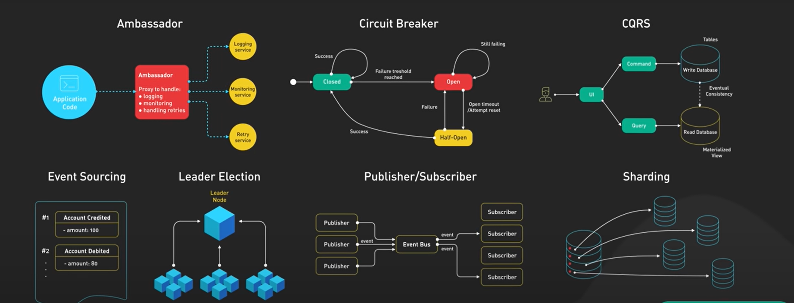
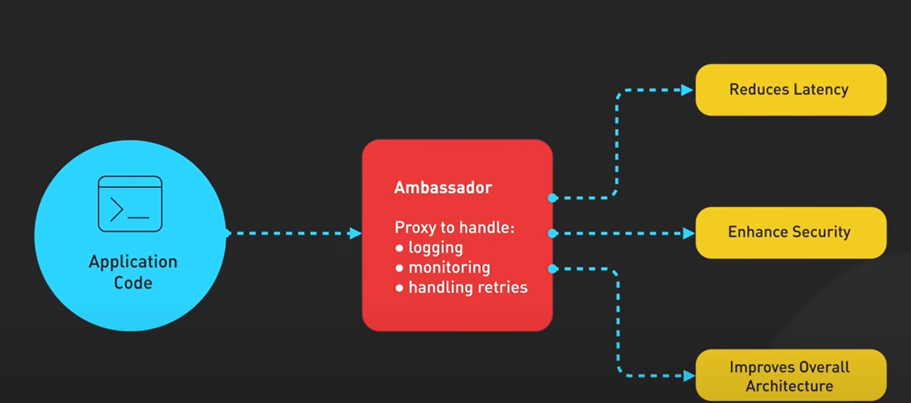

# Distributed Design Pattern

## 1. Ambassador

Client --> Ambassador --> RemoteService

1. `Client`: The system that wants to use the service.

2. `Ambassador`: A local representative of the remote service. It handles connection, retries, timeouts, logging, etc.

3. `Remote Service`: The actual external resource or service.

