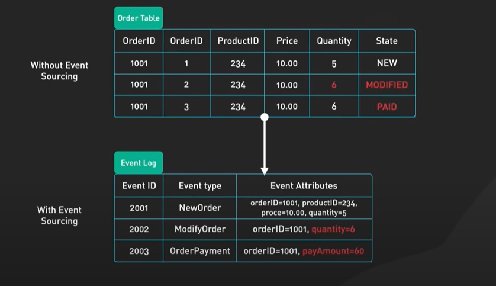

# Distributed Design Pattern


## 1. Ambassador

Client --> Ambassador --> RemoteService

1. `Client`: The system that wants to use the service.

2. `Ambassador`: A local representative of the remote service. It handles connection, retries, timeouts, logging, etc.

3. `Remote Service`: The actual external resource or service.


---

## 2. circuit Breaker

The **Circuit Breaker Pattern** is a **resilience pattern** used in distributed systems to prevent an application from repeatedly trying to execute an operation that's likely to fail — especially remote service calls.

### 🧠 Why Use It?

When a **remote service** is **down** or **slow**, continuously making requests can:

- Waste resources
- Cause cascading failures
- Increase response time

A **circuit breaker** `breaks the connection temporarily after repeated failures`, allowing the system to recover gracefully.

### 🔄 Circuit Breaker States

1. **`Closed`**

   - Everything works normally.
   - Requests flow through.
   - Failures are monitored.

2. **`Open`**

   - Too many failures occurred.
   - Requests are **immediately blocked**.
   - A fallback response is usually returned.

3. **`Half-Open`**
   - After a timeout, a few trial requests are allowed.
   - If successful, the circuit moves to **Closed**.
   - If not, it returns to **Open**.


### ✅ Benefits

- Prevents **resource exhaustion**
- Encourages **fallback** and **self-healing**
- Improves **resilience** in microservices and distributed systems

---

## 3. ⚙️ CQRS (Command Query Responsibility Segregation)

**CQRS** is a **design pattern** that separates **read** and **write** operations in a system. The idea is to split the model into:

- **`Commands`**: Operations that **change** data (write).
  - Commands `trigger domain logic and write to the database`.
- **`Queries`**: Operations that **retrieve** data (read).
  - Queries `read from a separate data source, often optimized for fast reads`.

### 🧠 Why Use CQRS?

Traditional CRUD-based architectures use a single model for both reads and writes. As systems grow complex, it becomes harder to optimize for both.

**CQRS** solves this by:

- **Decoupling** the read and write responsibilities
- Allowing each side to be **optimized independently**
- Enabling **scalability** and **flexibility**

### 🔄 CQRS Architecture Overview

```plaintext
                +----------------+         +----------------+
                |   Write Model  |         |   Read Model   |
Client --->     |  (Commands)    |         |   (Queries)    |
                +----------------+         +----------------+
                        |                         |
                   [Domain Logic]          [Query Handlers]
                        |                         |
                  [Data Store / DB]        [Read DB / Cache]

```


---

## 4. 📦 Event Sourcing Design Pattern

- **Event Sourcing** is a **`behavioral design pattern`** in which **state changes** in a system are stored as a **`sequence of events`**.
- Rather than storing the current state, the system **`persists every change`** that occurs.

### 🧠 Core Idea

Instead of saving just the current state in a database, you **store a log of all changes (events)**. The current state is then derived by **replaying** those events.

### 🔄 How It Works

```plaintext
User Action ---> Domain Logic ---> Create Event ---> Append to Event Store
                                                 ↳ Rebuild State by Replaying Events
```

### 🏁 Summary

| Aspect             | Description                                                                                                                                                                                                                                             |
| ------------------ | ------------------------------------------------------------------------------------------------------------------------------------------------------------------------------------------------------------------------------------------------------- |
| **Type**           | Behavioral / Persistence                                                                                                                                                                                                                                |
| **Use Case**       | Auditing, CQRS, high-performance data replication                                                                                                                                                                                                       |
| **Main Benefit**   | Immutable event log for traceability and reconstruction                                                                                                                                                                                                 |
| **Common Pairing** | CQRS, DDD (Domain-Driven Design)                                                                                                                                                                                                                        |
| Benefits           | 🔍 Full audit trail — you can see exactly what happened and when <br/> ⏪ Time travel — recreate past states by replaying events <br/> 🔁 Replayable — rebuild read models if needed <br/> 📦 Great for CQRS (Command Query Responsibility Segregation) |



---
