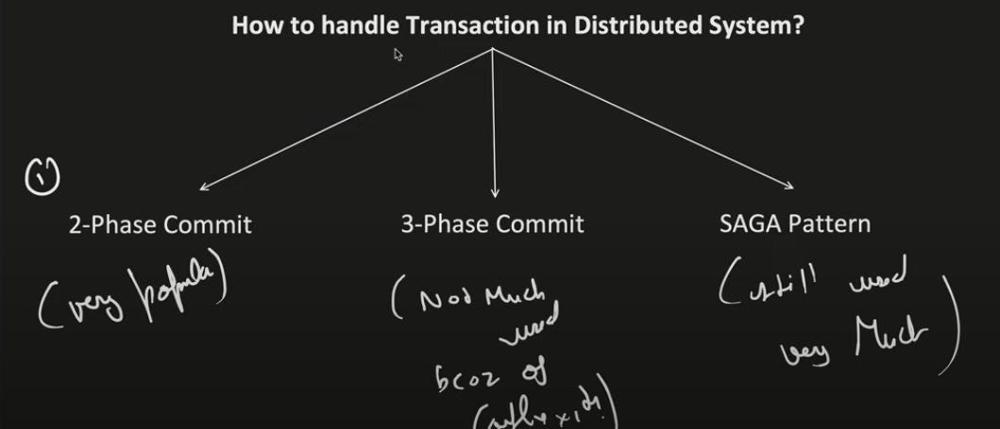
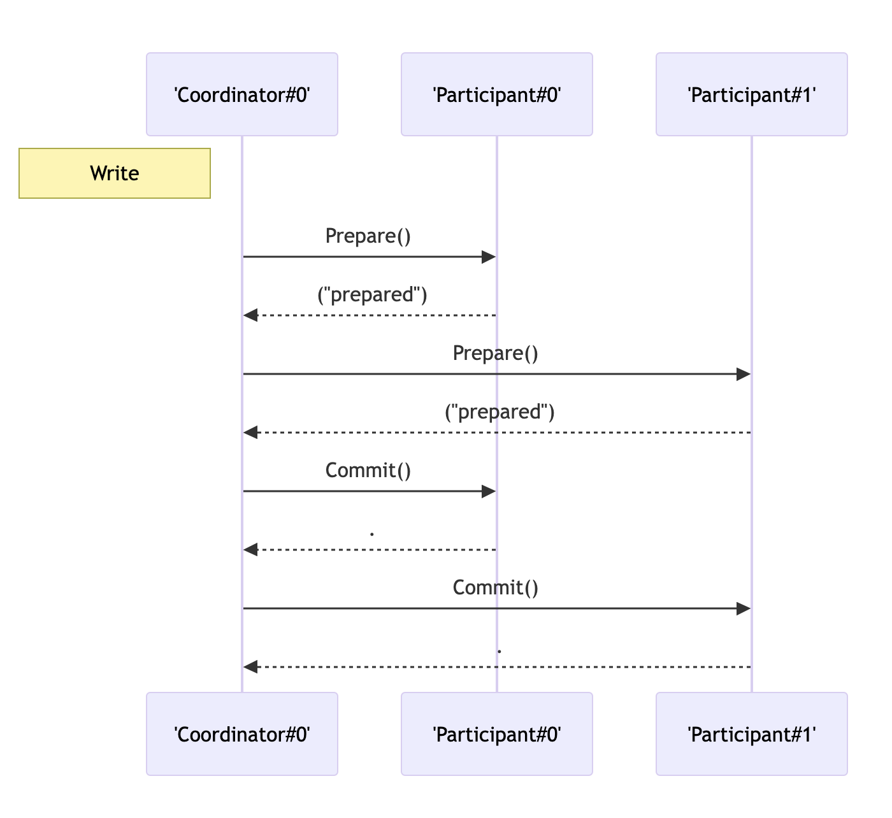
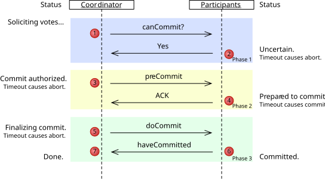
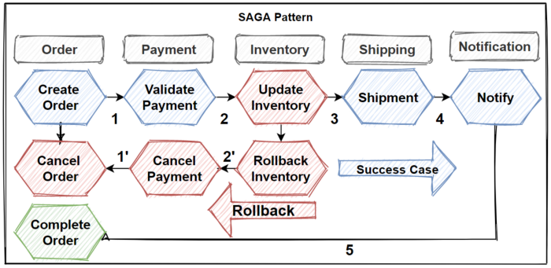

# How to handle distributed transaction?

- since `transaction is local/limited to its own db`, what will happen if multiple DB's are involved

## WAYS to handle

---

## 1. 2-Phase commit - Blocking [Synchronous]

- `voting/prepare phase`
- `Decision/commit phase`

### Problems with 2-Phase commit

- Transaction coordinator might fail
- participant can fail
- Prepare msg can get lost
- Reply form participant can get lost
- commit / Ok msg can get lost

- `Participant are not aware of coordinator's decision when [coordinator is down]`

### Sol

- `log to be maintained by transaction coordinator and participant's`
- `timeout to be used to rollback and abort if some msg is not received`

---

## 2. 3-phase commit - [Non Blocking] [Synchronous]

- `voting/prepare phase`
- `pre-commit phase` **coordinator is sharing its decision**
- `Decision/commit phase`

---

## 3. SAGA Pattern [Asynchronous]

- long transaction
- where next transaction is depended on previous transaction
- `Event Notification`: After a local transaction, each service publishes an event or sends a message to notify other services to proceed with their respective local transactions.
- `Failure Handling (Compensation)`: If any service `fails during its local transaction, it will invoke compensating transactions to undo the changes made by previous services`. These compensations must be predefined and handled by each service.
- `Commit or Compensation`: Either the `entire saga commits successfully, or compensating actions` are taken to ensure consistency across services.

