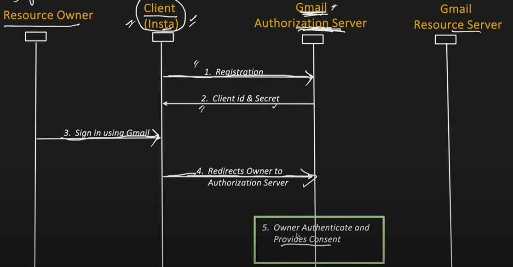
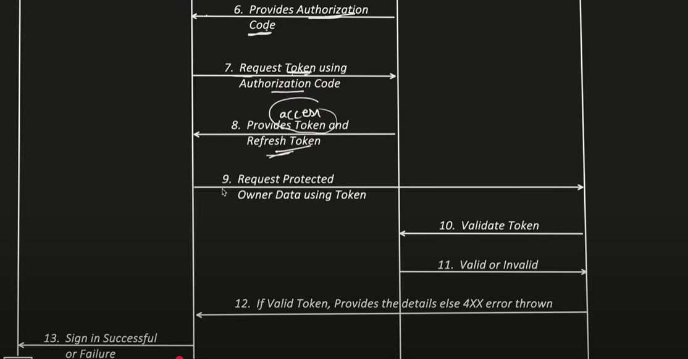

# OAuth2.0

- it is `authorization framework`
- `enables secure 3rd party access to user's secure data`

## Actors involved

- resource owner
  - who is going to use its google/github/facebook account
- client
  - who is going to give the option to login/auth via google/github/facebook account
- Authorization server
  - google/github/facebook Authorization server
- Resource Hosting server

## Authorization Grant Types [mechanism used by client to obtain ACCESS TOKEN]

- Authorization code grant ✅
  - auth code
  - with auth code gets access token
- implicit grant ❌
  - no auth code is sent
  - instead of 2 calls the access token is sent in one response
- Resource Owner password credential grant ❌
  - the auth server username and password is sent
- Client Credential grant
  - used when client and resource hosting server both are same
  - no auth code
  - access token response
- Refresh token grant

## Control Flow




## Request Samples

### 1. Register User

- Request

            POST /register
            body:
            {
                "client_name" : {my app name},
                "redirect_uris" : ["https://mysamplewebsite.com/", "https://mysamplewebsite.com/"]
            }

- Response:

```json
{
    "client_name" : {my app name},
    "client_id" : {unique id assigned to client}
    "client_secret" : {Confidential info, known only to client and authorization server, use for client authentic}
}
```

### 2. Fetch Authorization Code

- Request

            GET /authorize?
            response_type=code
            &client_id={id which client gets during registration}
            &redirect_uri={callback URI like https://mysamplewebsite.com/callback}
            &scope=scope1 scope2 scope3          // scope are what all data requested of users eg name of user is a scope, email
            &state={some random value like sj111}  // helps in avoid CSRF attack to only process the response if same state is present

### 3. Fetch Token

- Request:-

            POST/token?
            grant_type=authorization_code    // type of grant
            &code={authorization code here}
            &redirect_uri={callback URI like https://mysamplewebsite.com/callback}
            D &client_id={id which client get during registration}
            &client_secret={secret which client get during registration}

- Response:

```json
{
    "access_token": {access token value here},
    "token_type":"Bearer",
    "expires_in": 3600,
    "refresh_token": {refresh token value here},
}
```
