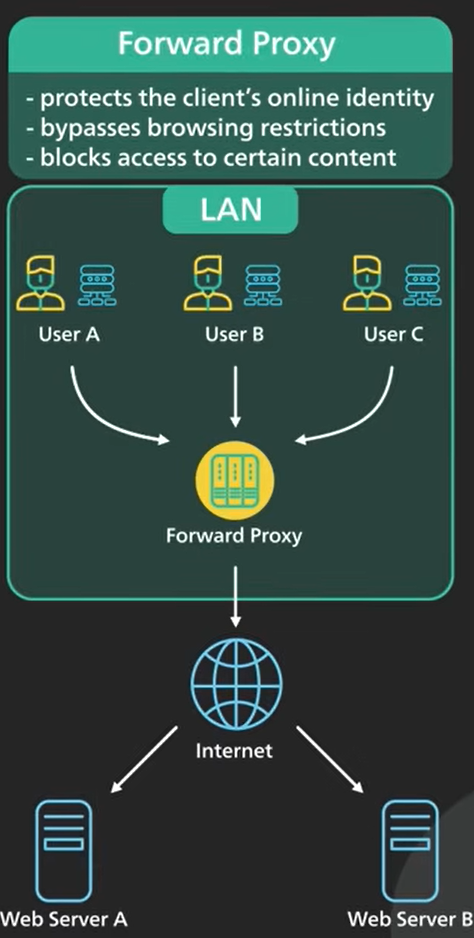
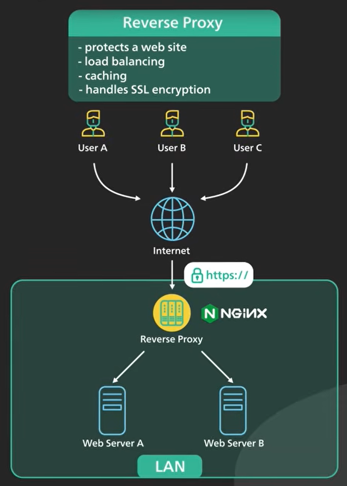

# Proxy

- Proxy is a` machine or a set of machines that sits in-between two systems` [Two services or a user and a system]

- Proxy servers ane installed to abstract out the complexities or untrusted env.

## Types

### Forward proxy

- Forward Proxy abstract out the client by acting as a middleman

- Why
  - `Security`:
    - protects the clients identity [external network sees the proxy IP add]
  - `policies` :
    - restricts access to certain website or tools
    - education inst / corporate
  - `Caching`
    - frequently access content

### Reverse Proxy

- abstracts the complexity downstream system
- eg `ngnix`, `loadbalancer`, `api-gateway`

- Why
  - `loadbalancing`
  - `routing`
  - `caching`
  - `abstraction` of webservrs/infra

