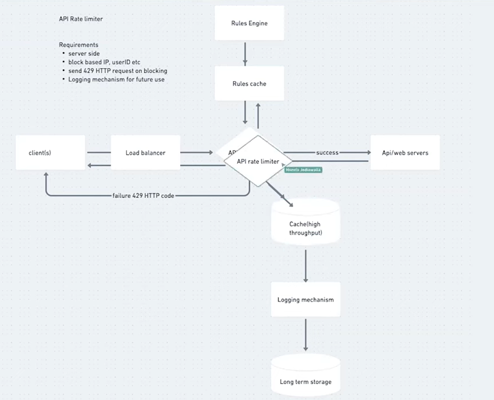

# RATE LIMITER [Distributed ENV]

- **`not on geographical base`**
  - as people `can bypass the rate limiter via VPN`
- **`Logging Cache`**
  - can have common cache or can have different read and write cache and then have syncing mechanism
- **`Rule engine`**
  - no need to have multiple rule engine as the `rules don't change frequently`

## clients to handle 429 - rate limiting

- retry mechanism
- gracefully handle 429 by showing appropriate message 'PLEASE TRY AFTER SOME TIME'

