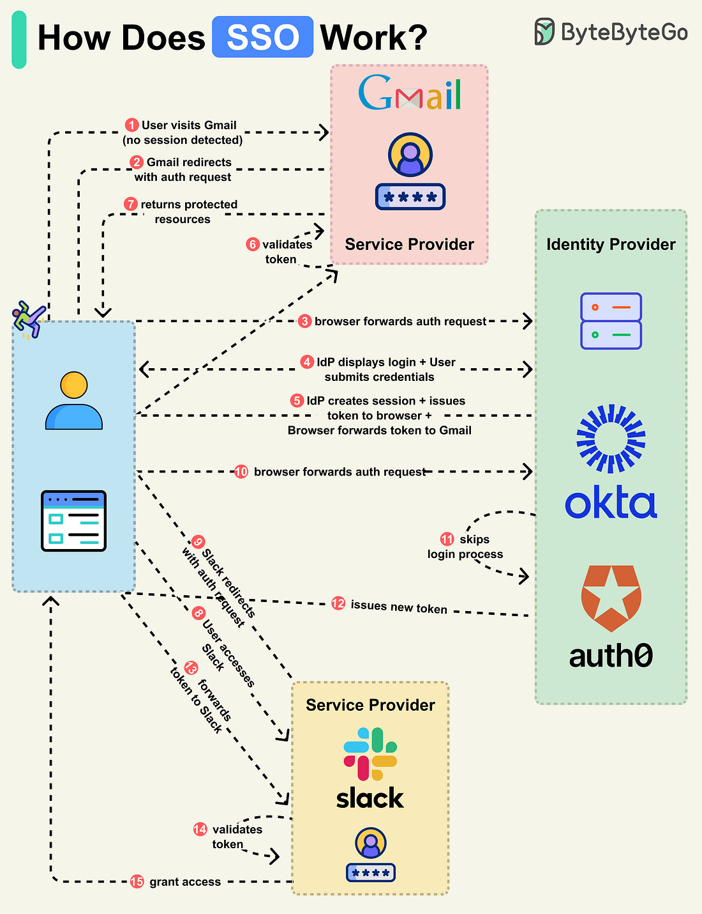

# SSO

- 1: A user accesses a protected resource on an application like Gmail, which is a Service Provider (SP).

- 2: The Gmail server detects that the user is not logged in and redirects the browser to the company’s Identity Provider (IdP) with an authentication request.

- 3: The browser sends the user to the IdP.

- 4: The IdP shows the login page where the user enters their login credentials.

- 5: The IdP creates a secure token and returns it to the browser. The IdP also creates a session for future access. The browser forwards the token to Gmail.

- 6: Gmail validates the token to ensure it comes from the IdP.

- 7: Gmail returns the protected resource to the browser based on what the user is allowed to access.

This completes the basic SSO login flow. Let’s see what happens when the user navigates to another SSO-integrated application, like Slack.

- 8-9: The user accesses Slack, and the Slack server detects that the user is not logged in. It redirects the browser to the IdP with a new authentication request.

- 10: The browser sends the user back to the IdP.

- 11-13: Since the user has already logged in with the IdP, it skips the login process and instead creates a new token for Slack. The new token is sent to the browser, which forwards it to Slack.

- 14-15: Slack validates the token and grants the user access accordingly.
