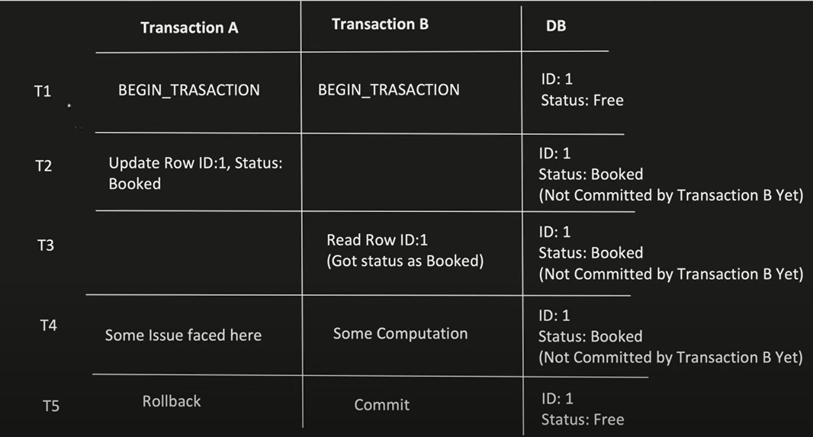
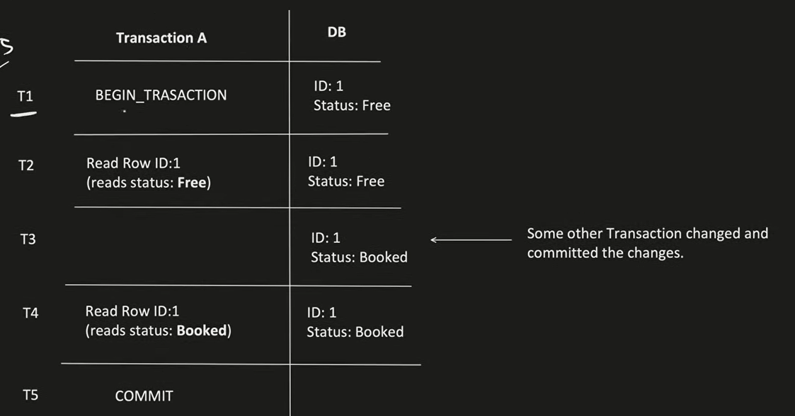
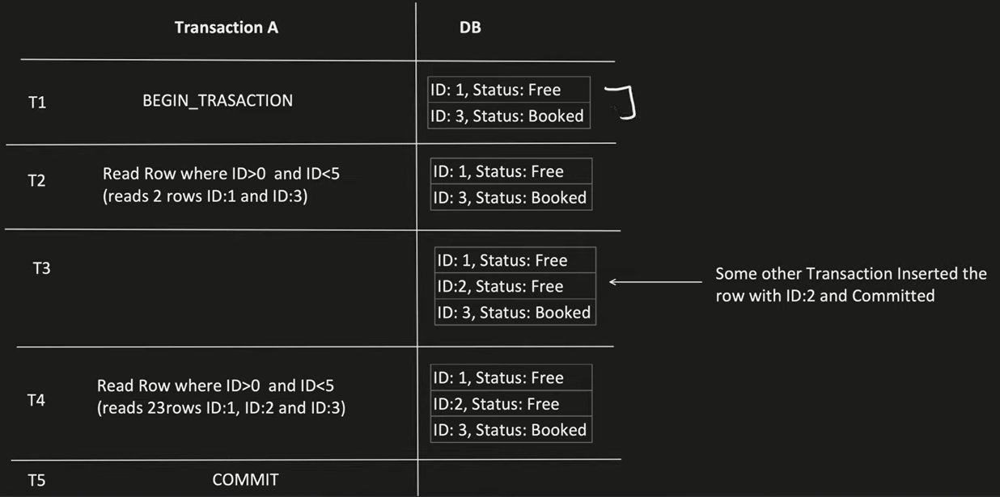

# Transaction

- in spring transaction works on `PROXY` based approach

- ACID
  - **A (Atomicity)**
    - Ensures all operations in `transaction are completed successfully. If any operation fails then entire transaction is rolled back`.
  - **C(Consistency)**
    - Ensures the `DB state before and after transaction in consistent`
  - **I (Isolation)**
    - Ensures that, if `multiple transactions are running in parallel, they do not interfere with each other`
  - **D(Durability)**
    - Ensures that `committed transaction will never be lost` despite of system failures

## 1. Programmatic way

- `TransactionManager` [I]
  - `PlatformTransactionManager` [I] implements TransactionManager
    - has methods
      - **getTransaction()**
      - **commit()**
      - **rollback()**
  - `AbstractPlatformTransactionManager` implements PlatformTransactionManager
    - provides implementation for
      - getTransaction()
      - commit()
      - rollback()
    - concrete class
      - `DataSourceTransactionManager`
        - `JdbcTransactionManager`
      - `HibernateTransactionManager`
      - `JPATransactionManager`
      - `JTATransactionManager` - for 2phase commit
- to know which transaction manager is used
  `TransactionAspectSupport.currentTransactionStatus()`

### 1. 1st way

```java
    @Component
    public class FirstProgrammaticApproach {
        PlatformTransactionManager transactionManager;

        public FirstProgrammaticApproach(PlatformTransactionManager transactionManager) { // PlatformTransactionManager bean is created down
            this.transactionManager = transactionManager;
        }

        public void updateUser(){
            TransactionStatus status = transactionManager.getTransaction( definition: null);
            try{
                System.out.println("Do Operations");
                transactionManager.commit(status);
            }catch (Exception e){
                transactionManager.rollback(status);
            }
        }
    }
```

### 2. USing Transaction Template

```java
    @Bean
    public TransactionTemplate transactionTemplate(PlatformTransactionManager transactionManager){
        return new TransactionTemplate(transactionManager);
    }
```

```java
    @Component
    public class SecondProgrammaticApproach {
        TransactionTemplate transactionTemplate;

        public SecondProgrammaticApproach(TransactionTemplate transactionTemplate) {
            this. transactionTemplate = transactionTemplate;
        }

        public void updateUser() {
            TransactionCallback<TransactionStatus> dbOperationTask = (TransactionStatus status)->{
                System.out.println("Perform Operations");
                return status;
            }

            transactionTemplate.execute(dbOperationTask);
        }
    }
```

## 2. Declarative way

- through transaction annotation
  - `@Transactional`
- spring will automatically choose the transaction manager, but we can tell which one to use explicitly also

### explicitly defining Transaction Manager

- In config class, `create bean for DATASOURCE`

```java
    @Bean
    public DataSource dataSource() {
        DriverManagerDataSource dataSoyrce = new DriverManagerDataSource();
        dataSource.setDriverClassName("org.h2.Driver");
        dataSource.setUrl("jdbc:h2:mem:testdb");
        dataSource.setUsername("root");
        dataSource.setPassword("Password");
        return dataSource;
    }
```

- then `create a bean for PlatformTransactionManager` and pass datasource created in above point.

```java
    @Bean
    public PlatformTransactionManager transactionManager(DataSource dataSource) {
        return new DataSourceTransactionManager(dataSource);
    }
```

- pass the platformTransactionManager method name

```java
    @Autowired
    BookRepository bookRepository;
    @Transactional(transactionManager = "transactionManager")
        public Book addBook(Book book) {
        return bookRepository.save(book);
    }
```

---

## Transaction Propagation

- Transaction propagation refers to `how transactions behave when a method annotated with @Transactional` is called by another method that may or may not have an active transaction.
- types
  - **REQUIRED**: `(default)`:
    - If a `transaction exists, use it; if not, create a new one`
  - **REQUIRES_NEW**:
    - `Always create a new transaction, suspend the existing one if an`
  - **NESTED**:
    - Execute the `transaction in a nested fashion within an existing one`.
    - `useful for partial rollback`
  - **SUPPORTS**:
    - `If a transaction exists, execute within the transaction`.
    - `If no transaction exists, execute without a transaction`.
  - **MANDATORY**:
    - If a `transaction exists, execute within it`.
    - If `no transaction` exists, `throw an exception `(TransactionRequiredException).
  - **NOT_SUPPORTED**:
    - If a `transaction exists, suspend it`.
    - `Execute the method outside any transaction`.
  - **NEVER**;
    - The method `must not run within a transaction`.
    - If a `transaction exists,an exception will be thrown` (IllegalTransactionStateException)

---

## ISOLATION LEVELS

- Isolation `[default depends on DB used]`:
  - `how changes made by one transaction is visible to transaction running in parallel`

| Propagation Type     | Dirty Read Possible                  | Non-repeatable read problem Possible                                              | Phantom Read Problem Possible                                                                                                          | Concurrency |
| -------------------- | ------------------------------------ | --------------------------------------------------------------------------------- | -------------------------------------------------------------------------------------------------------------------------------------- | ----------- |
|                      | value changed without commit is read | if same value is read multiple times but gets different value [single row/record] | getting different result using same query when run another time , as before 2nd read someone inserted the data [multiple records/rows] |
| READ_UNCOMMITTED     | Y                                    | Y                                                                                 | Y                                                                                                                                      | High        |
| READ_COMMITTED       | N                                    | Y                                                                                 | Y                                                                                                                                      | little less |
| REPEATABLE_COMMITTED | N                                    | N                                                                                 | Y                                                                                                                                      | little less |
| SERIALIZABLE         | N                                    | N                                                                                 | N                                                                                                                                      | less        |

### Problems

#### 1. Dirty Read

- If Transaction A is reading the data which is writing by Transaction B and not yet even committed.
- If Transaction B does the rollback, then whatever data read by Transaction A is know dirty read.



#### 2. Non-Repeatable Read

- If suppose Transaction A, reads the same `row several times and there is a chance that it reads different value`.
  

#### 3. Phantom Read

- If suppose Transaction A, `executes same query several times and there is a chance that the rows returned are different`.
  

### Isolation level problem sol

- `READ_UNCOMMITTED`
  - `no read/write locks are acquired [shared/exclusive lock]`
  - `best for ONLY READ operations`
- `READ_COMMITTED`
  - `read:Shared lock and released as soon as read is done`
  - `write:Exclusive lock and is kept till end of transaction`
- `REPEATABLE_COMMITTED`
  - read:Shared lock and is kept `till end of transaction `
  - write:Exclusive lock and is kept till end of transaction
- `SERIALIZABLE`

  - read:Shared lock and is kept `till end of transaction[range of records]`
  - write:Exclusive lock and is kept till end of transaction[range of records]

  

## Q> What happens inside when a Service having a method with @Transactional and is autowired.

- When used @Transaction the bean having this transactional is not directly injected, infact `a proxy is created extending the Service class and the proxy of the service is injected to the controller`

```java
public class BookServiceProxy extends BookService {
  public void getBook() {
    try {

      TransactionManager. beginTransaction();

      //Call the Actual Method
      super.getBook();

      //Commit Transaction if No Exception Occurs
      TransactionManager.commit();
    } catch (Exception e) {
      //  Rollback Transaction on Exception
      TransactionManager.rollback();
    }
  }
}
```

## Q> Types of Proxies

- `JDKDynamic Proxy => Interface`
- `CGLIB Proxy => Class`
