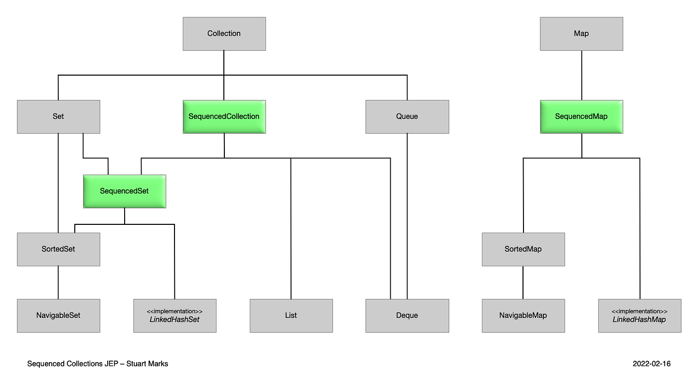
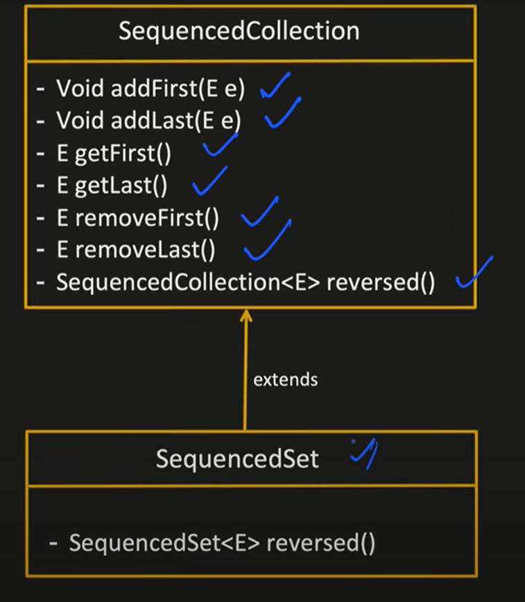
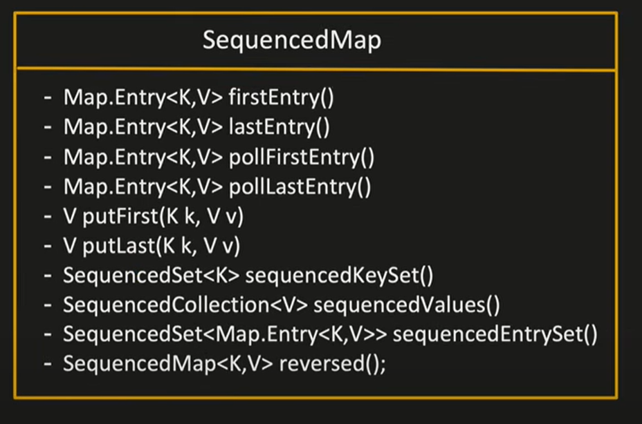

## Internal Implementation of HASHMAP

- `Buckets`
  - HashMap uses an array of "buckets" (or slots) to store the entries (key-value pairs). The size of the array is determined by the initial capacity of the HashMap
- `Hashing`
  - Find hashCode() of the key Objects.hash(key)
- find the bucket index using hashCode
- `Collisions Handling`: If multiple keys hash to the same bucket (hash collision),
  - in case of collision : `HashMap uses a linked list or a balanced tree (since Java 8)` to store the entries in that bucket.
- `Threshold for Resizing`: When the number of entries exceeds a certain threshold, the HashMap automatically re-sizes itself to maintain its efficiency.
  - This threshold is typically 75% of the current capacity.
- Complexity

  - Time
    - `Read, write, delete  -> O(1)`
    - incase of collision -> O(1)

- Space Complexity
  - O(n)

## How sequenced Collection categorized

1. Collection should follow `Predictable Iteration` :
   Means elements are returned in consistent and well defined order every time we iterate over the collection.
   So if a collection maintains elements in:

- Insertion order, or
- Sorted order (e.g., ascending or descending)
  Then we can say, it follows Predictable iteration.

2. Collection `provide support for Access or Manipulate the First and Last element`

3. Collection `supports Reversible View`

