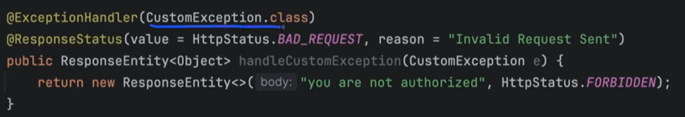
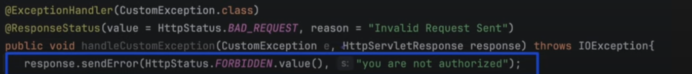

# Spring Exception handling

https://www.youtube.com/watch?v=xfUspC01iDM

## HandlerExceptionResolverComposite

1. `ExceptionHandlerExceptionResolver`
   a. @controllerAdvice
   b. @ExceptionHandler
2. `ResponseStatusExceptionResolver`
   a. Handles uncaughtException annotated with @ResponseStatus
   b. Only response status
3. `DefaultHandlerExceptionResolver`
   a. Predefined Spring Exception
4. `DefaultErrorAttribute`
   a. Create a default responseEntity with `status 500 if responseEntity is not set by customException`

## Scenarios

1. `DefaultErrorAttribute will set 500 if no status is set using setError in exception handling`
2. If not response entity is set then DefaultErrorAttribute sets the default response entity
3. @ExceptionHandler => method can take 3 param
   i. `HttpServletRequest`
   ii. `HttpServletResponse`
   iii. `CustomException` [if multiple exception is present for ExceptionHandler then Exception]
4. If same custom exception is mentioned in Controller and ControllerAdvice the controller customException will be invoked
5. Priority is given to exact matching exception and if not found then parent
6. Scenario1
   i. 
   - In above since @ExceptionHandler is present [will be resolved by exceptionHandlerExceptionResolver] it will not move to [ResponseStatusExceptionResolver]
   - But in the above message will change to @ResponseStatus because it is overridden by spring framework
   - Once a resolver any of the 3, it never moves to next exceptionResolver'
7. Scenario 2
   i. 
   - In the above one since responseEntity is not returned it will go to DefaultErrorAttribute and status will be 500
