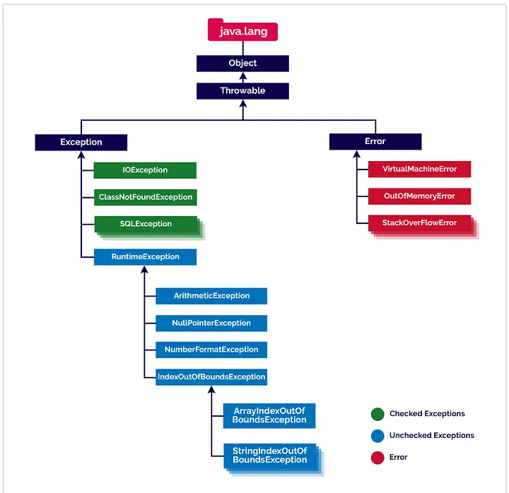

# Exception



## checked exceptions

- checked exceptions are also known as `compileTime exceptions`.
- Checked exceptions are those which need to be taken care at compile time.

## unchecked exceptions

- unchecked exceptions are also known as `runtime exceptions`.
- Unchecked exceptions are those which need to be taken care at runtime.

## java.lang.Error

- Error is a subclass of `Throwable`
- Error indicates some serious problems that our application should not try to catch.
- Errors are abnormal conditions in application.
- Error and its subclasses are regarded as unchecked exceptions

### 3. What is the difference between `throw` and `throws` in Java?

**Answer:**

- **`throw`**: The `throw` keyword is used to explicitly throw an exception in a method or block of code. It allows you to create an instance of an exception class and throw it to indicate an error condition. For example:

  ```java
  throw new IllegalArgumentException("Invalid input");

  ```

- **throws**:
  - The throws keyword is used in a method declaration to specify `that the method may throw one or more exceptions`.
  - It is used to `declare exceptions that a method does not handle but passes on to the calling method for handling`

```java
 public void readFile() throws IOException {
   // code that may throw an IOException
}

```
