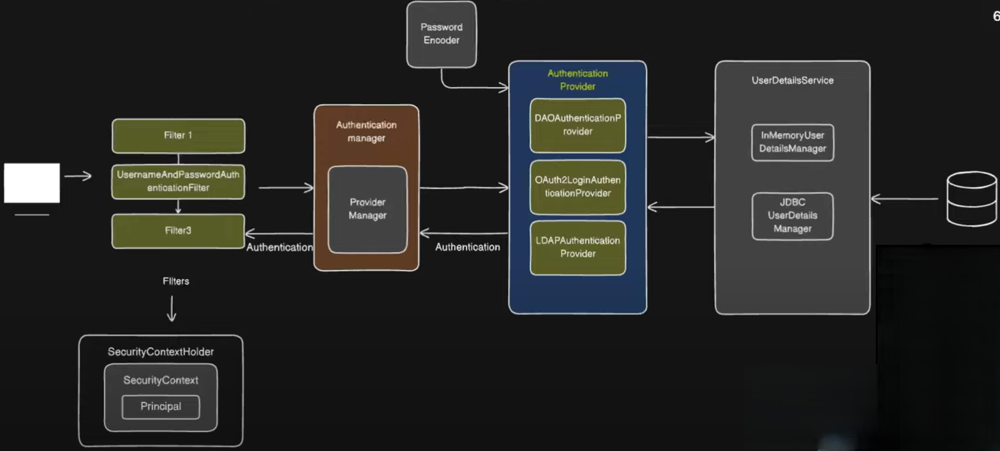

## Attacks

- CSRF [cross site request forgery]

  - browser sends the session id
  - use CSRF-token

- XSS [cross site scripting]

  - malicious scripts
  - can be used to steal the cookie by appending the document.cookie
  - use angular dom sanitization for all user input

- CORS

- SQL injection

## Spring Security

@EnableWebSecurity <spring-boot-starter-security>

1. depending on the authenticationType security filter will be invoked
2. then passed to AuthenticationManager I [authenticate() -> ProviderManager]
3. delegates to AuthenticationProvider
4. bean securityFilterChain
   - authenticationProvider

```java
@Configuration
@EnableMethodSecurity(
    prePostEnabled = true,  // Enable @PreAuthorize and @PostAuthorize
    securedEnabled = true,  // Enable @Secured annotation
    jsr250Enabled = true    // Enable @RolesAllowed annotation
)
public class SecurityConfig {
    // Spring Security method-level security is enabled here
}

@PreAuthorize: Enables pre-invocation security checks based on SpEL expressions.
@PostAuthorize: Enables post-invocation security checks based on SpEL expressions.
@Secured: Restricts method access based on roles/authorities.
@RolesAllowed: Restricts method access based on roles (from JSR-250).
@EnableAspectJAutoProxy: (Optional) Enables AOP for method security annotations
```

## Why csrf.disabled() done

- as we `use stateless app, no session and no cookies`

## Date & Time classes

- problem in old
  - date & calender
    - mutable
    - confusing
    - limited functionality without zone[no calc]

1. LocalDate: Represents a date without a time zone.
2. LocalTime: Represents a time without a date or time zone.
3. LocalDateTime: Represents a date and time without a time zone.
4. ZonedDateTime: Represents a date and time with a time zone.
5. Instant: Represents an instantaneous point on the timeline, typically used for machine timestamps.
6. Duration: Represents a duration of time between two points in time.
7. Period: Represents a period of time between two dates.
8. DateTimeFormatter: Formats and parses dates and times.

## Method Reference [::]

- when lambda expression can be replaced with method of some class/object
  - the method should do same thing what lambda was suppose to do [same parameter/return]
- same but with constructor is constructor reference
  - ClassName::new

## Filters

- `Sits in between servlet and Spring application Context`
- `DelegatingFilterProxy` works as bridge between servlet and Spring application Context.


- `FilterChainProxy` is the who has `securityFilterChain` where all filters relates to security are present


- spring will` not filter for all types of authentication, for spring provide AuthenticationProvider`
  - for any auth `provide AuthenticationProvider`
- in o`rder to spring to know which AuthenticationProvider` to use `AuthenticationManager [I] -> ProviderManager` comes into pic where it behaves as a bridge between filter and AuthenticationProvider
  - `supports()` of AuthenticationProvider helps in finding which one will be used
  - AuthenticationProvider has `Authenticate()` which will actually to authentication.


- `SecurityContextHolder` and SecurityContextHolderFilter remembers the context when used password based
  - has `securityContext/Principal`



- `ExceptionTranslationFilter` catches all the exception
